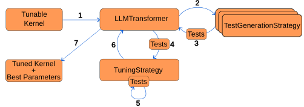

Design documentation
====================

This section provides design of the framework and its components. **This section is mainly for developers.**

Here is a picture of high level overview of the framework:

Each box represents a component in the framework. Let's go though each of the components.

* **TunableKernel** - The initial kernel that will be tuned (:class:`TunableKernel <llm_kernel_tuner.TunableKernel>`).
* **LLMKernelTransformer** - The main component of the framework that generates the tests and starts the tuning of the kernel (see also :class:`LLMKernelTransformer <llm_kernel_tuner.LLMKernelTransformer>`).
* **TestGenerationStrategy** - Testing strategy that extends :class:`BaseTestingStrategy <llm_kernel_tuner.testing_strategies.BaseTestingStrategy>`. This component is responsible for generating tests for the kernel. There can also be multiple TestGenerationStrategies.
* **Test** - Tests are either generated by the test generation strategy or can be passed by user before the tuning process. Each tests describes input data, expected output and the problem size.
* **TuningStrategy** - Tuning strategy that extends :class:`BaseTuningStrategy <llm_kernel_tuner.tuning_strategies.BaseTuningStrategy>`. This component describes how the kernel will be tuned and tunes the kernel. (See :ref:`tuning_strategies`)
* **Tuned Kernel + Best Parameters** - This is the output after calling :func:`make_kernel_tunable <llm_kernel_tuner.LLMKernelTransformer.make_kernel_tunable>` on the :class:`LLMKernelTransformer <llm_kernel_tuner.LLMKernelTransformer>` . It returns the new tuned kernel and the best parameters for the new kernel.

Here is a more detailed overview of what is happening in each step:

#. :class:`TunableKernel <llm_kernel_tuner.TunableKernel>` is being passed to :class:`LLMKernelTransformer <llm_kernel_tuner.LLMKernelTransformer>` to tune the kernel.
#. :class:`LLMKernelTransformer <llm_kernel_tuner.LLMKernelTransformer>` calls all the test generation strategies to create tests for the kernel.
#. Each of the test generation strategies returns tests that it generated.
#. ``TuningStrategy`` is called to tune the kernel. All tests are provided to the ``TuningStrategy`` so that they can be executed in between steps.
#. Tuning strategy generates new kernel and executes tests on it to verify its correctness. 
#. When the ``TuningStrategy`` is done with tuning, it returns best performing kernel and the best parameters that are associated with it.
#. After all the tuning steps are done return the tuned kernel with the best parameters for that kernel.
