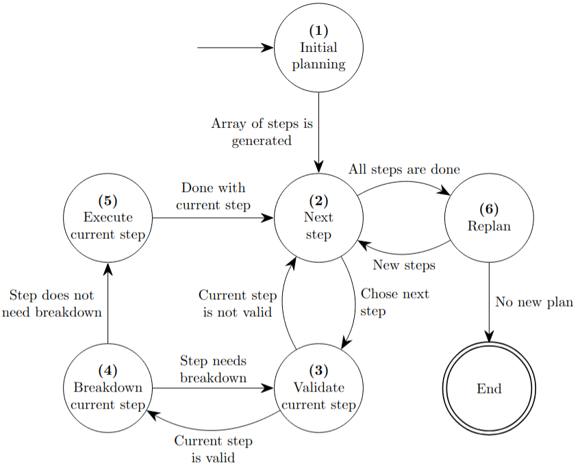

.. _tuning_strategies:

Tuning strategies
=================

Tuning strategy defines how the kernel will be tuned.

LLM Kernel Tuner provides 3 different strategies :ref:`One Prompt Tuning Strategy`, :ref:`autonomous_tuning_strategy` and the :ref:`Explicit Tuning Strategy`.
You can also define your own :ref:`custom_tuning_strategy`

.. _one_prompt_tuning_strategy:

One Prompt Tuning Strategy
--------------------------

One Prompt tuning strategy prompts the LLM in one prompt.

.. _autonomous_tuning_strategy:

Autonomous Tuning Strategy
--------------------------

| As the name suggests, the autonomous tuning strategy is fully autonomous. It is inspired by Plan-and-solve idea :cite:`wang2023planandsolvepromptingimprovingzeroshot` where an LLM first generates a plan and then executes the generated plan. The main difference with the original Plan-and-solve and our method is that each step is executed one prompt at the time instead of the whole plan in one prompt. This is done because many steps generated by LLMs have errors or cannot be applied for tuning.
| :numref:`autonomous_strategy_image` illustrates the decision tree of the autonomous strategy.

| Below is a more detailed explanation of the key components (numbers correspond to the labeled nodes in :numref:`autonomous_strategy_image`):

1. The first step in the strategy is called "planning" as it plans out the steps that will be taken to tune the kernel. This step is expected to generate a list of optimization steps that will improve the performance of the kernel.
2. Second step in the strategy looks at the remaining optimization steps and chooses the first optimization step in the array as the current optimization step to execute. If there are no optimization steps remaining it goes to the re-planning step **(6)**.
3. Often the LLMs return a non valid optimization step. For example one of the optimization steps might include profiling or changing the compiler arguments. These optimization steps are not considered tuning as there are no parameters inside the kernel code that can be tuned. This strategy step is separated from the initial planning step to increase robustness and accuracy, you can read about it more in the paper (TODO: add paper reference).
4. This strategy step will ask LLM whether the current optimization step needs to be broken down into smaller optimization steps.
    | If the optimization step is broken down then all new optimization steps are added to the beginning of the optimization steps list. New current optimization step is chosen as the first step of the optimization steps list and we go back to **(3)** the verification step in the strategy.
    | If the current optimization step does not need to be broken down we go to the next step **(5)**.
5. This strategy step generates new kernel and potentially new tuning parameters by applying current optimization step to the kernel. The output of the newly generated kernel is compared to the previous kernel to insure the correctness of the newly generated kernel.
    1. LLMs can have difficulty adhering to use tuning parameters or often introduce parameters with similar names (e.g. block\_size and BLOCK\_SIZE\_X). Therefore there is a step that "fixes" the tuning parameters to always have the tuning parameter in code and not introduce parameters with similar names.
6. This strategy step decides whether to try new steps or not by looking at the kernel that was generated and optimization steps that have been taken thus-far.
    | If new optimization steps are generated we go back to step **(2)**.
    | If no news optimization steps are generated we are done.

| **Note:** Breakdown **(4)** and replan **(6)** steps are optional steps that can be disabled before the execution of the strategy.
| When breakdown step **(4)** is disabled, the validation step **(3)** proceeds directly to the execution step **(5)** if the step is valid.
| Likewise when replan step is disabled, next step **(2)** step transitions to the end instead of the replan step if there are no more steps to execute.

    Workflow image of autonomous strategy with step numbering

.. _autonomous_strategy_examples:

Autonomous Strategy example
~~~~~~~~~~~~~~~~~~~~~~~~~~~

Disabling breakdown of steps and disable replanning
^^^^^^^^^^^^^^^^^^^^^^^^^^^^^^^^^^^^^^^^^^^^^^^^^^^

.. code-block:: python

    from llm_kernel_tuner import LLMKernelTransformer
    from llm_kernel_tuner.tuning_strategies import AutonomousTuningStrategy

    kernel_string = "...""

    autonomous_tuning_strategy = AutonomousTuningStrategy(with_replanning=False, breakdown_steps=False)

    kernel_transformer = LLMKernelTransformer(kernel_string, tuning_strategy=autonomous_tuning_strategy)

Changing max breakdown count and max replanning count
^^^^^^^^^^^^^^^^^^^^^^^^^^^^^^^^^^^^^^^^^^^^^^^^^^^^^

.. code-block:: python

    from llm_kernel_tuner import LLMKernelTransformer
    from llm_kernel_tuner.tuning_strategies import AutonomousTuningStrategy

    kernel_string = "..."

    autonomous_tuning_strategy = AutonomousTuningStrategy(max_breakdowns=2, max_replanning=5)

    kernel_transformer = LLMKernelTransformer(kernel_string, tuning_strategy=autonomous_tuning_strategy)

.. _explicit_tuning_strategy:

Explicit Tuning Strategy
------------------------

| Explicit tuning strategy has all the optimization steps predefined. The idea of the explicit tuning strategy is that we try as many optimizations as possible and see which of them improve the performance of the kernel. Each optimization can be seen as a step in a long sequence of CoT. The explicit tuning strategy keeps a list of tuning strategies that need to be executed and executes them one after another while keeping track of the best-performing kernel thus far.

| Some of the optimization steps can have dependencies between them; this allows for more granularity and a more navigable CoT. For example, instead of asking an LLM to use *n* elements per thread immediately, we can ask it to first do *2* elements per thread, and after that we can ask it to do *n* elements per thread with a tunable parameter.
| Before each step is executed, the necessity of the step is evaluated by asking LLM whether or not it is a good idea to implement the step. This can be disabled per step if it is deemed that a step is always necessary.

.. _tuning_steps:

    
Tuning Steps
~~~~~~~~~~~~

You can override the default tuning steps and replace them with your own tuning steps. You will need to create a List of :class:`TuningStep <llm_kernel_tuner.tuning_strategies.tuning_step.TuningStep>` and pass it to the :class:`ExplicitTuningStrategy <llm_kernel_tuner.tuning_strategies.ExplicitTuningStrategy>`.
Here is an example of how it can be done:

.. code-block:: python

    from llm_kernel_tuner import LLMKernelTransformer
    from llm_kernel_tuner.tuning_strategies import ExplicitTuningStrategy, TuningStep
    from langchain_core.prompts import PromptTemplate

    kernel_code = "..."

    my_promtp_template = PromptTemplate.from_template("... {kernel_string} ...")

    my_tuning_steps: List[TuningStep] = [
        TuningStep(id="tuning_step_id", 
            prompt_template=my_promtp_template
        ),
    ]

    explicit_tuning_strategy = ExplicitTuningStrategy()

    kernel_transformer = LLMKernelTransformer(kernel_code, tuning_strategy=explicit_tuning_strategy)

.. note::
    ``prompt_template`` should include the variable ``kernel_string`` inside itself. This is where the kernel code will be pasted in as a string.

Each step may generate tunable parameters, if that is the case you can specify them in a dictionary with predefined values like so:

.. code-block:: python
    
    my_tuning_steps: List[TuningStep] = [
        TuningStep(id="tuning_step_id", 
            prompt_template=my_promtp_template
            tune_params={"block_size": [32, 64, 128, 256]}
        ),
    ]

The code above will try to tune the kernel by brute forcing possible values for "block_size", in this case 32, 64, 128 and 256.

Step evaluation
^^^^^^^^^^^^^^^

Before each step is run a step will be evaluated by an LLM to whether this tuning step makes sense to implement.
If you want to remove that you can set :py:attr:`~llm_kernel_tuner.tuning_strategies.tuning_step.TuningStep.skip_evaluation` to ``True``.

Step dependencies
^^^^^^^^^^^^^^^^^

There is also a possibility to add dependencies between steps. This allows for steps to be skipped if the previous step did not yield any benefits.

.. 
    TODO: the opposite behaviour might be more beneficial?

Here is a full example with multiple tuning steps and dependencies:

.. code-block:: python

    from llm_kernel_tuner import LLMKernelTransformer
    from llm_kernel_tuner.tuning_strategies import ExplicitTuningStrategy, TuningStep
    from langchain_core.prompts import PromptTemplate
    from typing import List

    kernel_code = "..."

    my_promtp_template1 = PromptTemplate.from_template("... {kernel_string} ...")
    my_promtp_template2 = PromptTemplate.from_template("... {kernel_string} ...")

    # Define custom tuning steps
    my_tuning_steps: List[TuningStep] = [
        TuningStep(id="tuning_step_id_1", 
            prompt_template=my_promtp_template1,
            tune_params={"block_size_x": [32, 64, 128, 256]}
            skip_evaluation=True
        ),
        TuningStep(id="tuning_step_id_2", 
            prompt_template=my_promtp_template2,
            tune_params={"tune_param": [2, 4, 8]},
            depends_on=["tuning_step_id_1"]
        ),
    ]

    # Create the strategy with custom steps
    explicit_tuning_strategy = ExplicitTuningStrategy()

    # Use the strategy with a kernel transformer
    kernel_transformer = LLMKernelTransformer(kernel_code, tuning_strategy=explicit_tuning_strategy)

.. bibliography::